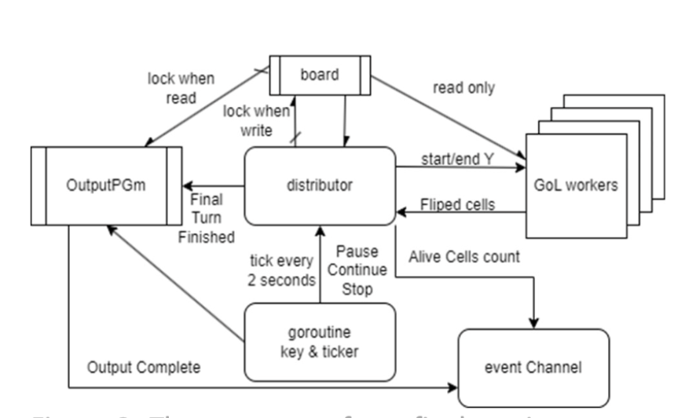
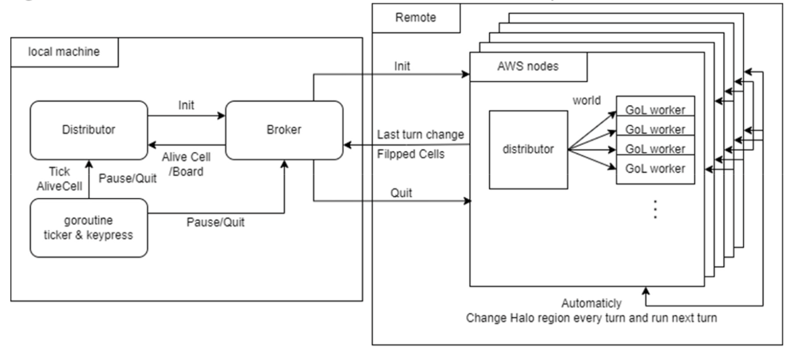

# Simulation of Conway's Game Of Life 
## Parallel and Distributed programming
Golang implementation of Conway's Game of Life. Also known simply as Life, is a cellular automaton devised by the British mathematician John Horton Conway in 1970.

The "game" is a zero-player game, meaning that its evolution is determined by its initial state, requiring no further input. One interacts with the Game of Life by creating an initial configuration and observing how it evolves, or, for advanced "players", by creating patterns with particular properties.

1.Any live cell with fewer than two live neighbours dies, as if caused by under-population.

2.Any live cell with two or three live neighbours lives on to the next generation.

3.Any live cell with more than three live neighbours dies, as if by over-population.

4.Any dead cell with exactly three live neighbours becomes a live cell, as if by reproduction.

### Part1. Parallel

We Implement the logic to visualise the state of the game using SDL.  
Also, the following are control rules. Note that the goroutine running SDL provides us with a channel containing the relevant keypresses.

If `s` is pressed, generate a PGM file with the current state of the board.
If `q` is pressed, generate a PGM file with the current state of the board and then terminate the program. Your program should not continue to execute all turns set in gol.Params.Turns.
If `p` is pressed, pause the processing and print the current turn that is being processed. If p is pressed again resume the processing and print "Continuing". It is not necessary for q and s to work while the execution is paused.

Test the visualisation and control rules by running `go run .`

(The diagram shows parallel part's structure)

### Part2. Distributed

In this stage, we create an implementation that uses a number of AWS nodes to cooperatively calculate the new state of the Game of Life board, and communicate state between machines over a network. 

the local controller is able to manage the behaviour of the GoL engine according to the following rules:

If `s` is pressed, the controller should generate a PGM file with the current state of the board.
If `q` is pressed, close the controller client program without causing an error on the GoL server. A new controller should be able to take over interaction with the GoL engine. Note that you are free to define the nature of how a new controller can take over interaction. Most likely the state will be reset. If you do manage to continue with the previous world this would be considered an extension and a form of fault tolerance.
If `k` is pressed, all components of the distributed system are shut down cleanly, and the system outputs a PGM image of the latest state.
If `p` is pressed, pause the processing on the AWS node and have the controller print the current turn that is being processed. If `p` is pressed again resume the processing and have the controller print "Continuing". It is not necessary for q and s to work while the execution is paused.
Test the control rules by running `go run .`

(The diagram shows parallel part's structure)

